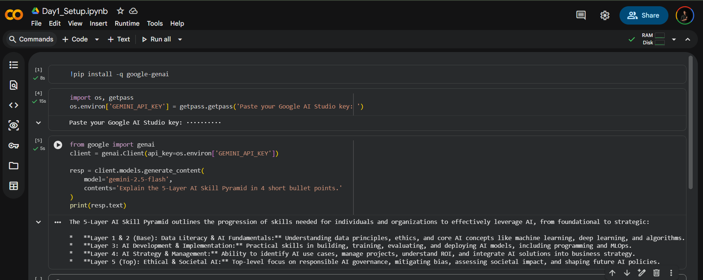
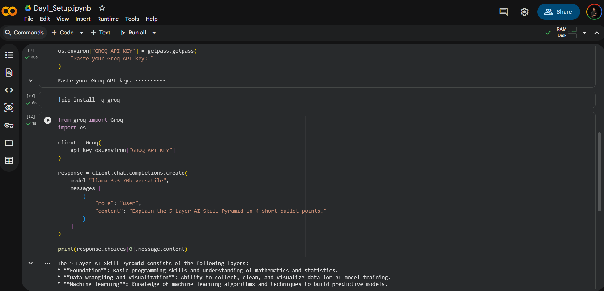

# AI Mentor Bootcamp — Shaik Thaheer

Public portfolio of 12-day AI Trainer Workshop. By Day 12: 6 daily notebooks + capstone Streamlit URL.

## Day 1 — Setup1 complete

- ✅ Google AI Studio API key provisioned
- ✅ Hello-Gemini call working — see [Day1_Setup.ipynb](Day1_Setup.ipynb)
- 4-tool comparison matrix from Lab 1A: see screenshot below
- 

## Day 1 — Setup2 complete

- ✅ Groq API key provisioned
- ✅ Hello-Groq call working — see [Day1_Setup.ipynb](Day1_Setup.ipynb)
- 4-tool comparison matrix from Lab 1A: see screenshot below

## Day 1 — Lab 1A: 4-Tool AI Comparison Complete ✅

### Lab Results: 4-Tool Comparison Matrix (All 12 Cells Filled)

| Tool | Task 1 (Summarise) | Task 2 (Code) | Task 3 (Reason) | Verdict |
|------|-------------------|---------------|-----------------|---------|
| **ChatGPT** | 4 | 4 | 4 | All-rounder. Best default choice for general tasks where I need a fast, well-structured response. |
| **Claude** | 5 | 4 | 5 | Best for thorough writing, careful reasoning, and high-stakes writing. |
| **Gemini** | 4 | 3 | 3 | Good for quick factual queries. Weaker at code constraints and pure reasoning. |
| **Perplexity** | 4 | 3 | 2 | Best when I need cited sources for factual claims I cannot afford to get wrong. |

### 3-Sentence Mentor Verdict

✅ **I would use ChatGPT for general tasks where I need a fast, well-structured response.**

✅ **I would use Claude for long documents, careful reasoning, and high-stakes writing.**

✅ **I would use Perplexity for any factual claim I cannot afford to get wrong.**

### Acceptance Checklist

- ✅ **Matrix with all 12 cells filled with concrete reasoning** (not 1-word scores)
  - Task 1: Summarization fidelity, structure quality, word limit adherence
  - Task 2: Code correctness, readability, standard library constraint
  - Task 3: Logic accuracy, reasoning transparency, confidence calibration

- ✅ **3-sentence conclusion documented** (above + in [Day1_Setup.ipynb](Day1_Setup.ipynb))

- ✅ **Pushed to public GitHub repo** 
  - Repository: [https://github.com/thaheer786/ai-mentor-portfolio](https://github.com/thaheer786/ai-mentor-portfolio)
  - Status: Green checkmark ✓ (commit 7b4cb7e)

### Lab Materials

- [Day1_Setup.ipynb](Day1_Setup.ipynb) — Complete notebook with matrix analysis
- [4tool_comparison_matrix.csv](4tool_comparison_matrix.csv) — Structured scoring data
- [README.md](README.md) — This file with verdicts and acceptance checks

---

## Day 2 - 
